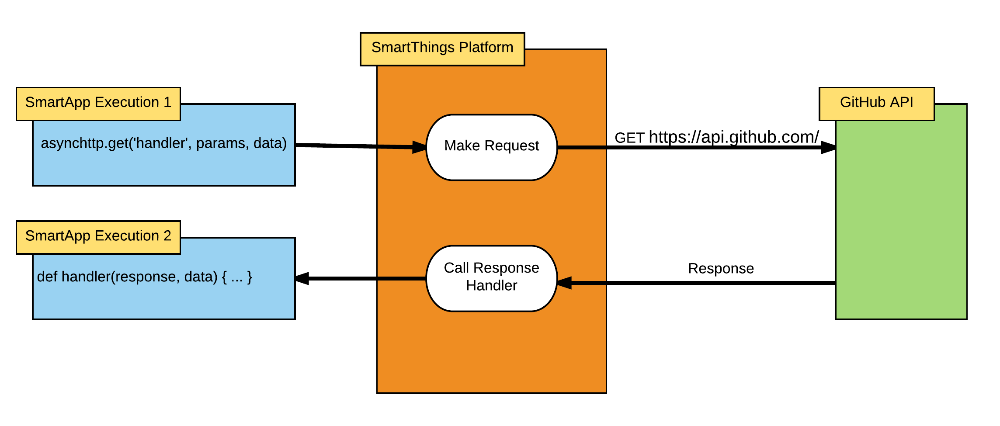

=======================================
|beta-icon2| Asynchronous HTTP Requests
=======================================

.. admonition:: Beta Feature
   :class: beta-feature

   The ability to make asynchronous HTTP requests is currently available as a beta development feature.

   These APIs are subject to change without notice.

Overview
--------

SmartApps and Device Handlers may need to communicate with third party services via HTTP.
This can be accomplished using the various HTTP APIs such as ``httpGet()``, ``httpPost()``, ``httpPut()``, etc.
But, these APIs are synchronous in nature - the currently executing SmartApp or Device Handler waits for the response from the third party.
This synchronous execution occupies the current thread executing the SmartApp or Device Handler, and increases the liklihood of hitting the execution timeout.

To address these issues, we're releasing new APIs so SmartApps and Device Handlers can make HTTP requests *asynchronously*.
We specify the details of the request, along with the name of a method (that we must implement) to call with the response.
SmartThings will then execute the request, and then call the specified request handler method when the response is received.

With asynchronous HTTP requests, we're far less likely to encounter execution timeouts due to a slow third party service.

----

Making Asynchronous HTTP Requests
---------------------------------

Let's jump right in and look at an example asynchronous HTTP request.
Our example simply makes a ``GET`` request to the GitHub API, and logs the response.
Don't worry about the details yet, the rest of this documentation will cover cover it.

.. code-block:: groovy

    include 'asynchtpp'

    def initialize() {
        def params = [
            uri:  'https://api.github.com',
            contentType: 'application/json'
        ]
        def data = [key1: "hello world"]

        asynchttp.get('requestHandlerMethod', params, data)
    }

    def requestHandlerMethod(response, data) {
        log.debug "got response data: ${response.getData()}"
        log.debug "data map passed to handler method is: $data"
    }

The first thing you may notice is the ``include`` directive.
This is a new feature in SmartThings that allows various APIs to be grouped together by their functionality.
Don't worry too much about it now, it is discussed in detail :ref:`below <include_directive>`.
For now, just think of it as a way to import a set of APIs that exist in a specific namespace - in this case, "``asynchttp"``.

The code to make an asynchronous HTTP request is fairly straightforword.
We specify information such as the URI in a parameter map, and then invoke the ``asynchttp.get()`` method passing the name of the method we want to handle the response, the request parameters, and an optional map of data to pass on to the response handler.

We then need to define our response handler method, which accepts the response of the request, as well as the optional data map we passed to the ``get()`` method.

The figure below illustrates at a high level what happens when the code above is executed:

It's important to note that while making a request (shown as *SmartApp Execution 1* in the above diagram) and receiving a response (*SmartApp Execution 2*) are separate executions, they are not necessarily sequential.
Other executions may occur between making the request and receiving the response, either as a result of a scheduled execution or event callbacks.
See :ref:`async_http_when_to_use` for more information about using asynchronous versus synchronous HTTP requests.

Asynchronous requests are supported for the ``GET``, ``POST``, ``PUT``, ``HEAD``, and ``PATCH`` HTTP request methods.
A summary of the supported operations is documented :ref:`below <async_http_supported_methods>`.

----

.. _include_directive:

The Include Directive
---------------------

One of the features that makes SmartThings development simple is the availability of logically-named methods in our SmartApps and Device Handlers.
There's no packages or libraries to import; we simply invoke the method as if it we defined it right in our code.

This strength is also a potential weakness, as you may have noted.
Having all these methods defined and available in the *global namespace* leads to namespace pollution and possible collisions.
Adding additional methods to SmartApps and Device Handlers becomes more difficult; the more methods defined in the global namespace, the more likely the chance for collisions.
A large number of methods available in the global namespace also can lead to difficulty in finding and using the APIs that you need.

To address this, SmartThings has begun piloting a way to include various APIs through a declarative *include* statement.
Using it is simple (especially now, since ``'asynchttp'`` is the only available API to include!) - just add the following line to the top of your SmartApp or Device Handler:

.. code-block:: groovy

    include 'asynchttp'

*(Technically, it doesn't have to go the top of the file, but it must be at the global level - not in another method body. For clarity and readability, we recommend it be placed at the top of the file.)*

When using ``include()``, the SmartThings platform will attempt to find an internally registered API that matches the name provided.
If one is found, an instance of the class representing that API will be injected into the SmartApp or Device Handler.
Methods can then be invoked on this object just as you'd expect, for example ``asynchttp.get('callbackMethod', paramsMap)``.

.. note::

    You can also get a reference to the included API by using the *getter* form, i.e., ``getAsynchttp().post(...)``.
    This is actually how the API is injected into the SmartApp or Device Handler - by dynamically adding the method ``"get${registeredNamespace.capitalize()}"`` to the current scope.

    Because of `Groovy's syntactic getter shortcut <http://groovy-lang.org/style-guide.html#_getters_and_setters>`__, we can invoke the getter through simple field-like access.

    The shortcut property access form will be used throughout this documentation, and we suggest you follow the same pattern.

----

Configuring the Request
-----------------------

All asynchronous HTTP request methods require, as the first argument, the name of the method to call with the response.
We also need to specify some information about the request, such as the URI, any optional path, URL query parameters, HTTP headers, and the content type of the request.
We do so by passing a map of parameters.
The table below lists the supported keys in the map.

================== ===========
Key                Description
================== ===========
uri (required)     Either a URI or URL of of the endpoint to make a request from.
path               Request path that is merged with the URI.
query              Map of URL query parameters.
headers            Map of HTTP headers.
requestContentType The value of the ``Content-Type`` request header. Defaults to ``'application/json'``.
contentType        The value of the ``Accept`` request header. Defaults to the value of the ``requestContentType`` parameter if not specified.
================== ===========

Request Headers
^^^^^^^^^^^^^^^

As you see in the above table, the request headers ``Content-Type`` and ``Accept`` will be added to every request.
If you need to set other request headers, specify them using the ``headers`` key in the parameters map:

.. code-block:: groovy

    def params = [
        uri: 'https://api.github.com',
        path: '/repos/SmartThingsCommunity/SmartThingsPublic/events',
        headers: ['If-None-Match': 'c873e724d02caa124de0884535c32acb']
    ]

As configured above, the request would look like this:

.. code-block:: http

    GET /repos/SmartThingsCommunity/SmartThingsPublic/events HTTP/1.1

    Host: api.github.com
    Content-Type: application/json
    Accept: application/json
    If-None-Match: c873e724d02caa124de0884535c32acb

Request body
^^^^^^^^^^^^

HTTP request methods that may have a body can also specify a ``body`` in the parameters map.
The value of ``body`` can be a string, or if the ``requestContentType`` is ``"application/json"``, a Map or List (will be serialized to JSON).
The :ref:`async_http_ref_put`, :ref:`async_http_ref_post`, and :ref:`async_http_ref_patch` methods support the ``body`` option.

Here's an example making a ``POST`` request using a map for the body:

.. code-block:: groovy

    include 'asynchttp'

    def initialize() {
        def params = [
            uri: 'https://someapi.com',
            path: '/some/path',
            body: [key1: 'value 1']
        ]
        asynchttp.post(processResponse, params)
    }

    def processResponse(response, data) { ... }

Here's what the request looks like (note that the ``Content-Type`` and ``Accept`` headers are ``"application/json"`` by default):

.. code-block:: http

    POST /some/path

    Host: someapi.com
    Content-Type: application/json
    Accept: application/json

    {"key1": "value 1"}

Here's an example making a ``PUT`` request using a string as the body:

.. code-block:: groovy

    include 'asynchttp'

    def initialize() {
        def params = [
            uri: 'https://someapi.com',
            path: '/some/path',
            body: "<entity><name>test</name></entity>",
            requestContentType: "application/xml"
        ]
        asynchttp.put(processResponse, params)
    }

    def processResponse(response, data) { ... }

And here's the request made by the above example:

.. code-block:: http

    PUT /some/path

    Host: someapi.com
    Content-Type: application/xml
    Accept: application/xml

    <entity><name>test</name></entity>

Query parameters
^^^^^^^^^^^^^^^^

Extending our GitHub API example, let's consider what the request configuration for an API call to get all occurences of the ``httpGet()`` method in the SmartThingsPublic GitHub repository:

.. note::

    A full discussion of the GitHub API is well beyond the scope of this documentation, but the example usage here will be fairly self-explanatory.
    For more information, consult the `GitHub API documentation <https://developer.github.com/v3/>`__.

    Also, we are keeping our query string simple.
    It's possible that just searching for "httpGet" will catch false positives, but we're more concerned with showing how to use the asynchronous HTTP APIs than creating a perfect query.

.. code-block:: groovy

    def initialize() {
        def params = [
            uri: 'https://api.github.com',
            path: '/search/code',
            query: [q: "httpGet+repo:SmartThingsCommunity/SmartThingsPublic"],
            contentType: 'application/json'
        ]
        asynchttp.get(processResponse, params)
    }

    def processResponse(response, data) { ... }

The request made given the code above would look like this:

.. code-block:: http

    GET /search/code?q=httpGet+repo:SmartThingsCommunity/SmartThingsPublic HTTP/1.1

    Host: api.github.com
    Content-Type: application/json
    Accept: application/json

Next, we'll look at how to process the response from asynchronous HTTP requests.

----

Handling the Response
---------------------

Once SmartThings executes the response we specified and receives a response from the third party, the request handler method we specified will be called.
It will be called with an instance of :ref:`async_response_ref`, which allows us to get information about the response.

The response handler method must also accept a map of data that may have been specified in the request.
This can be useful for passing data between the time we create the request and when the response is received.
If no (optional) data was specified when making the request, the request handler method will be called with ``null`` for the second parameter.
We'll discuss this optional data parameter later in this documentation.

JSON responses
^^^^^^^^^^^^^^

Continuing the GitHub example, let's look at how we can process the response to our query.
We want to know how many files in the SmartThingsPublic repository use the ``httpGet()`` method, and what those file names are.
Since the GitHub API responds with a JSON response, and SmartThings will automatically parse the JSON into a data structure for us, processing the response is fairly simple:

.. code-block:: groovy

    include 'asynchttp'

    def initialize() {
        def params = [
            uri: 'https://api.github.com',
            path: '/search/code',
            query: [q: "httpGet+repo:SmartThingsCommunity/SmartThingsPublic"]
        ]
        asynchttp.get(processResponse, params)
    }

    def processResponse(response, data) {
        // json response already parsed into JSONElement object
        def results = response.json
        def total = results?.total_count

        log.debug "there are $total occurences of httpGet in the SmartThingsPublic repo"

        // for each item found, log the name of the file
        results?.items.each { log.debug "httpGet usage found in file $it.name" }
    }

When this documentation was written, executing the above query resulted in the following output (remember that the SmartThings Live Logging places the most recent statement at the top):

.. code-block:: bash

    3:14:15 AM: debug httpGet usage found in file smart-energy-service.groovy
    3:14:15 AM: debug httpGet usage found in file quirky-connect.groovy
    3:14:15 AM: debug httpGet usage found in file withings-manager.groovy
    3:14:15 AM: debug httpGet usage found in file ecobee-connect.groovy
    3:14:15 AM: debug httpGet usage found in file lifx-connect.groovy
    3:14:15 AM: debug httpGet usage found in file life360-connect.groovy
    3:14:15 AM: debug httpGet usage found in file netatmo-connect.groovy
    3:14:15 AM: debug httpGet usage found in file withings.groovy
    3:14:15 AM: debug httpGet usage found in file shabbat-and-holiday-modes.groovy
    3:14:15 AM: debug httpGet usage found in file goodnight-ubi.groovy
    3:14:15 AM: debug httpGet usage found in file wattvision-manager.groovy
    3:14:15 AM: debug httpGet usage found in file logitech-harmony-connect.groovy
    3:14:15 AM: debug httpGet usage found in file jenkins-notifier.groovy
    3:14:15 AM: debug httpGet usage found in file yoics-connect.groovy
    3:14:15 AM: debug httpGet usage found in file tesla-connect.groovy
    3:14:15 AM: debug httpGet usage found in file jawbone-up-connect.groovy
    3:14:15 AM: debug httpGet usage found in file weather-underground-pws-connect.groovy
    3:14:15 AM: debug there are 17 occurences of httpGet in the SmartThingsPublic repo

``getJson()`` will throw an Exception if the response body cannot be parsed to JSON, if the request failed to get a response, or if the response status code is not 2XX.
See the :ref:`async_response_ref_get_json` reference documentation for more information.

XML responses
^^^^^^^^^^^^^

Getting the raw response
^^^^^^^^^^^^^^^^^^^^^^^^

Errors and warnings
^^^^^^^^^^^^^^^^^^^

Getting more information about the response
^^^^^^^^^^^^^^^^^^^^^^^^^^^^^^^^^^^^^^^^^^^

----

.. _passing_data_to_request_handler:

Passing Data to the Request Handler
-----------------------------------

00822954-162f-4e56-b26e-cf6fda06a73d  3:28:32 PM: debug there are 14 occurences of httpPost in the SmartThingsPublic repo
00822954-162f-4e56-b26e-cf6fda06a73d  3:28:32 PM: debug there are 17 occurences of httpGet in the SmartThingsPublic repo
00822954-162f-4e56-b26e-cf6fda06a73d  3:28:32 PM: debug there are 2 occurences of httpPut in the SmartThingsPublic repo
00822954-162f-4e56-b26e-cf6fda06a73d  3:28:32 PM: debug there are 3 occurences of httpDelete in the SmartThingsPublic repo
00822954-162f-4e56-b26e-cf6fda06a73d  3:28:32 PM: debug there are 0 occurences of httpHead in the SmartThingsPublic repo

----

.. _async_http_supported_methods:

Available Methods
-----------------

The following methods are available on the ``asynchttp`` object.
The HTTP request method will match the name of the method - see the reference documentation for more details on each method.

========= ======
HTTP Verb Method
========= ======
GET       :ref:`asynchttp.get(String callbackMethod, Map params, Map data = null) <async_http_ref_get>`
PUT       :ref:`asynchttp.put(String callbackMethod, Map params, Map data = null) <async_http_ref_put>`
POST      :ref:`asynchttp.post(String callbackMethod, Map params, Map data = null) <async_http_ref_post>`
PATCH     :ref:`asynchttp.patch(String callbackMethod, Map params, Map data = null) <async_http_ref_patch>`
HEAD      :ref:`asynchttp.head(String callbackMethod, Map params, Map data = null) <async_http_ref_head>`
========= ======

----

Error Conditions
----------------

In our GitHub API example, we show how can make a request to get the us
(example could be issuing a request to GitHub api with applicationXml contentType parameter. GitHub only sends JSON, so a 415 is sent back.)

----

Timeout, Response, and Data Size Limits
---------------------------------------

Request timeout limit
^^^^^^^^^^^^^^^^^^^^^

Requests will timeout after 40 seconds.
<TODO - what happens then? Exception?>

Response size limit
^^^^^^^^^^^^^^^^^^^

Data size limit
^^^^^^^^^^^^^^^

----

.. _async_http_when_to_use:

When to Use Asynchronous versus Synchronous
-------------------------------------------

----

.. |beta-img| image:: ../img/beta.jpg
.. |beta-icon| unicode:: U+03B2
.. |beta-icon2| unicode:: U+26A0
