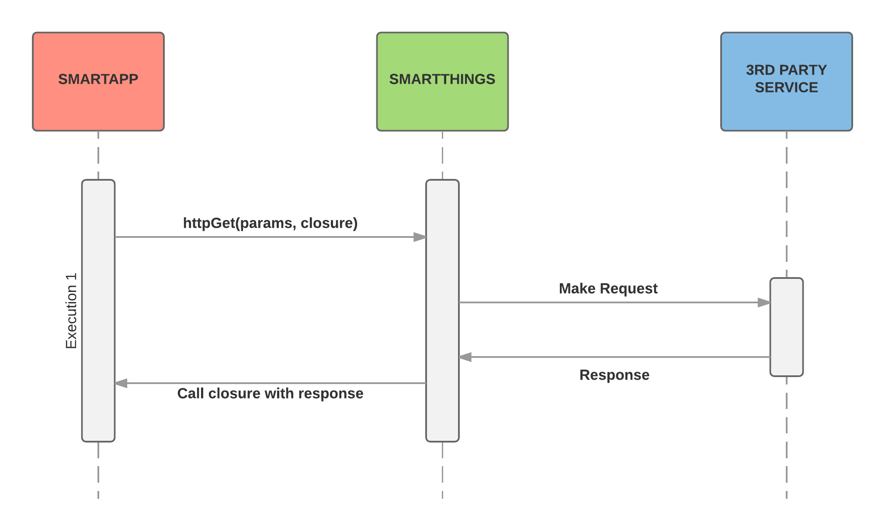
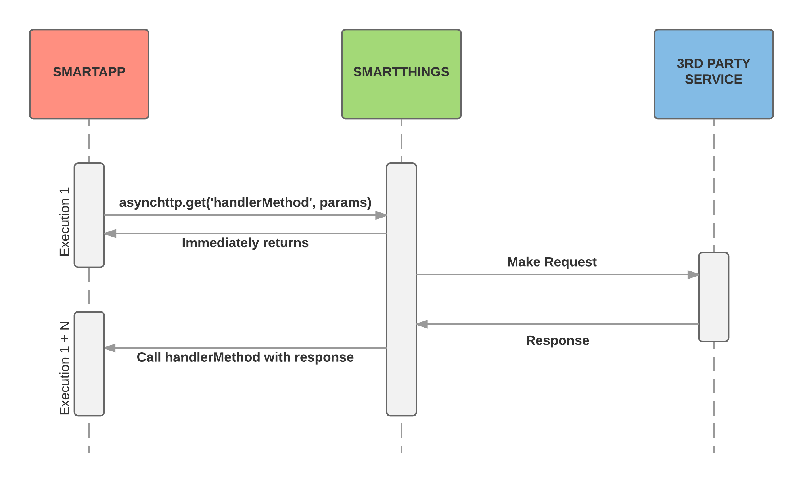

.. _async_http_guide:

==================================================
Making Asynchronous External HTTP Requests (Beta!)
==================================================

.. include:: ../common/async-http-beta-note.txt

Overview
--------

SmartApps and Device Handlers may need to communicate with third party services via HTTP.
This can be accomplished using the various HTTP APIs such as ``httpGet()``, ``httpPost()``, ``httpPut()``, etc, as discussed in the :ref:`calling_web_services` documentation.
But, these APIs are synchronous in nature - the currently executing SmartApp or Device Handler waits for the response from the third party.
This synchronous execution blocks the current thread executing the SmartApp or Device Handler, and increases the likelihood of hitting the execution timeout.

To address these issues, we're releasing new APIs so SmartApps and Device Handlers can make HTTP requests *asynchronously*.
We specify the details of the request, along with the name of a method (that we must implement) to call with the response.
SmartThings will then execute the request, and then call the specified request handler method when the response is received.

With asynchronous HTTP requests, we're far less likely to encounter execution timeouts due to a slow third party service.

----

Quick Example
-------------

Let's jump right in and look at an example asynchronous HTTP request.
Our example simply makes a ``GET`` request to the GitHub API, and logs the response.
Don't worry about the details yet, the rest of this documentation will cover it.

.. code-block:: groovy

    include 'asynchtpp'

    def initialize() {
        def params = [
            uri:  'https://api.github.com',
            contentType: 'application/json'
        ]
        def data = [key1: "hello world"]

        asynchttp.get('responseHandlerMethod', params, data)
    }

    def responseHandlerMethod(response, data) {
        log.debug "got response data: ${response.getData()}"
        log.debug "data map passed to handler method is: $data"
    }

The first thing you may notice is the ``include`` directive.
This is a new feature in SmartThings that allows various APIs to be grouped together by their functionality.
Don't worry too much about it now, it is discussed in detail :ref:`below <include_directive>`.
For now, just think of it as a way to import a set of APIs that exist in a specific namespace - in this case, "``asynchttp"``.

The code to make an asynchronous HTTP request is fairly straightforward.
We call ``asynchttp.get()`` with the name of the method we want to be called with the response, a map of data that is used to build the request, and an optional map of data to pass on to the response handler.
The details of the request builder parameters are documented in the :ref:`async_http_configure_request` section.

We then need to define our response handler method, which accepts the response of the request, as well as the optional data map we passed to the ``get()`` method.
The details of handling the response are documented in the :ref:`async_http_response_handling` section.

Synchronous versus Asynchronous
-------------------------------

The following diagrams illustrate the difference between making synchronous HTTP requests, and using the new asynchronous HTTP APIs.

*Synchronous HTTP Request Flow:*

*Asynchronous HTTP Request Flow:*

We can see from the above diagrams that a synchronous HTTP requests makes the requests, waits for the response, then processes the response, all in a single execution.

Asynchronous HTTP requests, on the other hand, handle the response in a *separate execution*.
The SmartThings platform makes the request, waits for the response, and then schedules a new SmartApp (or Device Handler) execution to call the specified response handler with the response.

It is important to note that these executions are not necessarily sequential.
Other executions may occur between making the request and receiving the response, either as a result of a scheduled execution or event callbacks.
See :ref:`async_http_when_to_use` for more information about using asynchronous versus synchronous HTTP requests.

Asynchronous requests are supported for the ``GET``, ``POST``, ``PUT``, ``DELETE``, ``HEAD``, and ``PATCH`` HTTP request methods.
A summary of the supported operations is documented :ref:`below <async_http_supported_methods>`.

----

.. _include_directive:

The Include Directive
---------------------

One of the features that makes SmartThings development simple is the availability of logically-named methods in our SmartApps and Device Handlers.
There are no packages or libraries to import; we simply invoke the method as if it we defined it right in our code.

This strength is also a potential weakness, as you may have noted.
Having all these methods defined and available in the *global namespace* leads to namespace pollution and possible collisions.
Adding additional methods to SmartApps and Device Handlers becomes more difficult; the more methods defined in the global namespace, the more likely a collision will occur.
A large number of methods available in the global namespace also can lead to difficulty in finding and using the APIs that you need.

To address this, SmartThings has begun piloting a way to include various APIs through a declarative *include* statement.
Using it is simple (especially now, since ``'asynchttp'`` is the only available API to include!) - just add the following line to the top of your SmartApp or Device Handler:

.. code-block:: groovy

    include 'asynchttp'

*(Technically, it doesn't have to go the top of the file, but it must be at the global level - not in another method body. For clarity and readability, we recommend it be placed at the top of the file.)*

When using ``include()``, the SmartThings platform will attempt to find an internally registered API that matches the name provided.
If one is found, an instance of the class representing that API will be injected into the SmartApp or Device Handler.
Methods can then be invoked on this object just as you'd expect, for example ``asynchttp.get('callbackMethod', paramsMap)``.

.. important::

    Included APIs (like ``asynchttp``) are currently **not** available to use when called from a child SmartApp.
    For example, if a SmartApp has a child SmartApp or Device Handler, and the child calls a method on the parent SmartApp that makes use of an included API, it will fail with a ``NullPointerException`` when trying to invoke methods on the included API.

    Methods that make use of APIs through the ``include`` method should only be called from within the SmartApp that includes the API.

    *(You might be tempted to work around this limitation by passing a reference to the included API from the child to the parent, so then the parent can use the API and make calls.
    Clever as this may sound, there are a few things to keep in mind.
    First, the included API may have a reference back to the SmartApp installation that included it.
    In the case of* ``asynchttp`` *, this reference to the SmartApp is how the callback method is called.
    So if you were to pass the included API to the parent to use to make an asynchronous request, the callback method would need to exist in the child SmartApp!
    This "workaround" creates a design that is difficult to understand and reason about, and is tightly coupled to the internals of how the API may or may not referenced the SmartApp that included it (and those internal implementation details may change).
    For these reasons, we don't suggest following this pattern, without at least being aware of the risks and design pitfalls of doing so.*

.. note::

    You can also get a reference to the included API by using the *getter* form, i.e., ``getAsynchttp().post(...)``.
    This is actually how the API is injected into the SmartApp or Device Handler - by dynamically adding the method ``"get${registeredNamespace.capitalize()}"`` to the current scope.

    Because of `Groovy's syntactic getter shortcut <http://groovy-lang.org/style-guide.html#_getters_and_setters>`__, we can invoke the getter through simple field-like access.

    The shortcut property access form will be used throughout this documentation, and we suggest you follow the same pattern.

----

.. _async_http_configure_request:

Configuring the Request
-----------------------

All asynchronous HTTP request methods require, as the first argument, the name of the method to call with the response.
We also need to specify some information about the request, such as the URI, an optional path, URL query parameters, HTTP headers, and the content type of the request.
We do so by passing a map of parameters.
The table below lists the supported keys in the map.

================== ===========
Key                Description
================== ===========
uri (required)     Either a URI or URL of the endpoint to make a request from.
path               Request path that is merged with the URI.
query              Map of URL query parameters.
headers            Map of HTTP headers.
requestContentType The value of the ``Content-Type`` request header. Defaults to ``'application/json'``.
contentType        The value of the ``Accept`` request header. Defaults to the value of the ``requestContentType`` parameter if not specified.
body               The request body to send. Can be a string, or if the ``requestContentType`` is ``"application/json"``, a Map or List (will be serialized to JSON). Only valid for ``PUT``, ``POST``, ``DELETE``, and ``PATCH`` requests.
================== ===========

URI and path
^^^^^^^^^^^^

The ``uri`` is required for all asynchronous HTTP request methods.
If specified, the ``path`` will be merged with the URI:

.. code-block:: groovy

    // uri and path merged to form "https://someapi.com/some/path"
    def params = [
        uri: 'https://someapi.com',
        path: '/some/path'
    ]

Note that only publicly accessible (i.e., non-local) addresses can be used when making HTTP requests.
See the :ref:`async_http_limits` section below for more information.

Request Headers
^^^^^^^^^^^^^^^

As you see in the above table, the request headers ``Content-Type`` and ``Accept`` will be added to every request.
If you need to set other request headers, specify them using the ``headers`` key in the parameters map:

.. code-block:: groovy

    def params = [
        uri: 'https://api.github.com',
        path: '/repos/SmartThingsCommunity/SmartThingsPublic/events',
        headers: ['If-None-Match': 'c873e724d02caa124de0884535c32acb']
    ]
    asynchttp.get('someHandlerMethod', params)

As configured above, the request would look like this:

.. code-block:: http

    GET /repos/SmartThingsCommunity/SmartThingsPublic/events HTTP/1.1

    Host: api.github.com
    Content-Type: application/json
    Accept: application/json
    If-None-Match: c873e724d02caa124de0884535c32acb

Query parameters
^^^^^^^^^^^^^^^^

URL query parameters can be added to the request by specifying a map as the value for the ``query`` key:

.. code-block:: groovy

    include 'asynchttp'

    def initialize() {
        // search for occurences of httpGet in the SmartThingsPublic repo
        def params = [
            uri: 'https://api.github.com',
            path: '/search/code',
            query: [q: "httpGet+repo:SmartThingsCommunity/SmartThingsPublic"],
            contentType: 'application/json'
        ]
        asynchttp.get(processResponse, params)
    }

    def processResponse(response, data) { ... }

The request made given the code above would look like this:

.. code-block:: http

    GET /search/code?q=httpGet+repo:SmartThingsCommunity/SmartThingsPublic HTTP/1.1

    Host: api.github.com
    Content-Type: application/json
    Accept: application/json

Request body
^^^^^^^^^^^^

HTTP request methods that may have a body can also specify a ``body`` in the parameters map.
The value of ``body`` can be a string, or if the ``requestContentType`` is ``"application/json"``, a Map or List (will be serialized to JSON).
The :ref:`async_http_ref_put`, :ref:`async_http_ref_post`, :ref:`async_http_ref_delete`, and :ref:`async_http_ref_patch` methods support the ``body`` option.

Here's an example making a ``POST`` request using a map for the body:

.. code-block:: groovy

    include 'asynchttp'

    def initialize() {
        def params = [
            uri: 'https://someapi.com',
            path: '/some/path',
            body: [key1: 'value 1']
        ]
        asynchttp.post(processResponse, params)
    }

    def processResponse(response, data) { ... }

Here's what the request looks like (note that the ``Content-Type`` and ``Accept`` headers are ``"application/json"`` by default):

.. code-block:: http

    POST /some/path

    Host: someapi.com
    Content-Type: application/json
    Accept: application/json

    {"key1": "value 1"}

Here's an example making a ``PUT`` request using a string as the body:

.. code-block:: groovy

    include 'asynchttp'

    def initialize() {
        def params = [
            uri: 'https://someapi.com',
            path: '/some/path',
            body: "<entity><name>test</name></entity>",
            requestContentType: "application/xml"
        ]
        asynchttp.put(processResponse, params)
    }

    def processResponse(response, data) { ... }

And here's the request made by the above example:

.. code-block:: http

    PUT /some/path

    Host: someapi.com
    Content-Type: application/xml
    Accept: application/xml

    <entity><name>test</name></entity>

----

.. _async_http_response_handling:

Handling the Response
---------------------

Once SmartThings executes the request we specified and receives a response from the third party, the request handler method we specified will be called (in a new execution of the SmartApp or Device Handler).
It will be called with an instance of :ref:`AsyncResponse <async_http_response_ref>`, which allows us to get information about the response.

The response handler method must also accept a map of data that may have been specified in the request.
This can be useful for passing data between the time we create the request and when the response is received.
If no (optional) data was specified when making the request, the request handler method will be called with ``null`` for the second parameter.
We'll discuss this optional data parameter later in this documentation.

The signature of the response handler method should look like:

.. code-block:: groovy

    def someResponseHandler(response, data) {}

Response status code
^^^^^^^^^^^^^^^^^^^^

We can get the response status code if we need to handle different possible response codes:

.. code-block:: groovy

    def responseHandler(response, data) {
        def status = response.status
        switch (status) {
            case 200:
                log.debug "200 returned"
                break
            case 304:
                log.debug "304 returned"
                break
            default:
                log.warn "no handling for response with status $status"
                break
        }
    }

Response headers
^^^^^^^^^^^^^^^^

The AsyncResponse object contains all headers from the response as a map of key-value pairs (the return type is ``Map<String, String>``):

.. code-block:: groovy

    def responseHandler(response, data) {
        def headers = response.headers
        headers.each { header, value ->
            log.debug "$header: $value"
        }
        // can use array notation to get specific header values
        def etagHeader = response.headers['ETag']
    }

Error responses
^^^^^^^^^^^^^^^

Use the :ref:`async_response_ref_has_error` to check if the response has an error.
``hasError()`` will return true if any exception occurred during the request.

**Any non-2XX response is also considered an error.**

You can get any error messages using the :ref:`async_response_ref_get_error_message` method.

.. code-block:: groovy

    def responseHandler(response, data) {
        if (response.hasError()) {
            log.debug "response received error: ${response.getErrorMessage()}"
        }
    }

In the case of an error response, you can also get the response body using :ref:`async_response_ref_get_error_data`, :ref:`async_response_ref_get_error_json`, or :ref:`async_response_ref_get_error_xml`.
Note that these methods will throw an exception if called on a successful response.

.. code-block:: groovy

    def responseHandler(response, data) {
        if (response.hasError()) {
            log.debug "error response data: $response.errorData"
            try {
                // exception thrown if json cannot be parsed from response
                log.debug "error response json: $response.errorJson"
            } catch (e) {
                log.warn "error parsing json: $e"
            }
            try {
                // exception thrown if xml cannot be parsed from response
                log.debug "error response xml: $response.errorXml"
            } catch (e) {
                log.warn "error parsing xml: $e"
            }
        }
    }

JSON responses
^^^^^^^^^^^^^^

If the response from a request is JSON, we can get a fully-formed JSONObject of the response using :ref:`async_response_ref_get_json`.
The example below illustrates getting the JSON response from a GitHub API call to get the occurrences of "httpGet" in the SmartThingsPublic repository.

.. code-block:: groovy

    include 'asynchttp'

    def initialize() {
        def params = [
            uri: 'https://api.github.com',
            path: '/search/code',
            query: [q: "httpGet+repo:SmartThingsCommunity/SmartThingsPublic"]
        ]
        asynchttp.get(processResponse, params)
    }

    def processResponse(response, data) {
        if (response.hasError()) {
            log.error "response has error: $response.errorMessage"
        } else {
            def results
            try {
                // json response already parsed into JSONElement object
                results = response.json
            } catch (e) {
                log.error "error parsing json from response: $e"
            }
            if (results) {
                def total = results?.total_count

                log.debug "there are $total occurences of httpGet in the SmartThingsPublic repo"

                // for each item found, log the name of the file
                results?.items.each { log.debug "httpGet usage found in file $it.name" }
            } else {
                log.debug "did not get json results from response body: $response.data"
            }
        }
    }

``getJson()`` will throw an Exception if the response body cannot be parsed to JSON, if the request failed to get a response, or if the response status code is not 2XX.
See the :ref:`async_response_ref_get_json` reference documentation for more information.

XML responses
^^^^^^^^^^^^^

Handling XML responses is similar to JSON - the XML is parsed into a data structure that we can use:

.. code-block:: groovy

    include 'asynchttp'

    def initialize() {
      def params = [
          uri: 'https://httpbin.org',
            path: '/xml',
            requestContentType: 'application/xml'
        ]
        asynchttp.get('xmlResultsHandler', params)
    }

    def xmlResultsHandler(response, data) {
        // results look like:
        // <slideshow title="Sample Slide Show" date="Date of publication" author="Yours Truly">
        //     <slide type="all">
        //         <title>Wake up to WonderWidgets!</title>
        //     </slide>
        // </slideshow>
        if (!response.hasError()) {
            def slideshow
            try {
                slideshow = response.xml
            } catch (e) {
                log.error "error parsing XML from response: $e"
            }
            if (slideshow) {
                log.debug "title: ${slideshow.slide.title.text()}" // -> Wake up to WonderWidgets!
            }
        } else {
            log.error "error making request: ${response.getErrorMessage()}"
        }
    }

Like ``getJson()``, ``getXml()`` throws an exception if the results cannot be parsed to XML from the response body.
See :ref:`async_response_ref_get_xml` for more information.

Getting the raw response
^^^^^^^^^^^^^^^^^^^^^^^^

If we want to get the raw response data, we can do that using :ref:`async_response_ref_get_data`.

.. code-block:: groovy

    def responseHandler(response, data) {
        log.debug "the raw response data is: $response.data"
    }

----

.. _passing_data_to_request_handler:

Passing Data to the Request Handler
-----------------------------------

Given that the response for an asynchronous HTTP request is processed in a separate SmartApp or Device Handler execution, we may need a way to share data between when we make the request, and when the response handler is called.
Rather than store such data in :ref:`State <storing-data>`, we can pass a map of data to any of the asynchronous HTTP methods, and this will be be passed along to the response handler:

.. note::

    All response handler methods must accept a second parameter for the data map, even if no data is specified on the request.
    In that case, the value passed to the response handler will be ``null``.

    If your response handler does not accept the second parameter, a ``MethodMissingException`` error will be thrown when the platform tries to call your response handler.

.. code-block:: groovy

    include 'asynchttp'

    def initialize() {
        def params = [uri: 'https://someapi.com']
        def data = [key1: "value 1", key2: "value 2"]
        asynchttp.get(handler, params, data)
    }

    def handler(response, data) {
        // logs [key1: "value 1", key2: "value 2"]
        log.debug "data passed to response handler: $data"
    }

----

.. _async_http_supported_methods:

Available Methods
-----------------

The following methods are available on the ``asynchttp`` object.
The HTTP request method will match the name of the ``asynchttp`` method - see the reference documentation for more details on each method.

========= ======
HTTP Verb Method
========= ======
GET       :ref:`asynchttp.get(String callbackMethod, Map params, Map data = null) <async_http_ref_get>`
PUT       :ref:`asynchttp.put(String callbackMethod, Map params, Map data = null) <async_http_ref_put>`
POST      :ref:`asynchttp.post(String callbackMethod, Map params, Map data = null) <async_http_ref_post>`
DELETE    :ref:`asynchttp.delete(String callbackMethod, Map params, Map data = null) <async_http_ref_delete>`
PATCH     :ref:`asynchttp.patch(String callbackMethod, Map params, Map data = null) <async_http_ref_patch>`
HEAD      :ref:`asynchttp.head(String callbackMethod, Map params, Map data = null) <async_http_ref_head>`
========= ======

----

.. _async_http_limits:

Host, Timeout, Response, and Data Size Limits
---------------------------------------------

.. _async_http_blacklisting:

Host and IP address restrictions
^^^^^^^^^^^^^^^^^^^^^^^^^^^^^^^^

Requests can only be made to publicly accessible hosts.
Remember that when executing an HTTP request, the request originates from the SmartThings platform (i.e., the SmartThings cloud), not from the hub itself.

Requests made to local or private hosts are not allowed, and will fail with a ``SecurityException``.

Request timeout limit
^^^^^^^^^^^^^^^^^^^^^

Requests will timeout after 40 seconds.
If the request timeout is hit, the response handler will be called and the response will have an error:

.. code-block:: groovy

    def responseHandler(response, data) {
        if (response.hasError()) {
            log.error "response has error: $response.errorMessage"
        }
    }

Response size limit
^^^^^^^^^^^^^^^^^^^

The current limit is 500,000 characters of response data.
This limit will be studied during the beta period, and may be adjusted as necessary.

When the limit is hit, the response body will be empty, but the response status will reflect the actual response status.
A warning message will be added to :ref:`async_response_ref_get_warning_messages` stating that the response size exceeded the limit.

Data size limit
^^^^^^^^^^^^^^^

The size of the data map that can be passed to the response handler is limited to 1000 characters when serialized to JSON.
If this limit is exceeded, an ``IllegalArgumentException`` will be thrown when making the request.

----

.. _async_http_when_to_use:

When to Use Asynchronous HTTP Requests
--------------------------------------

Simply put, prefer asynchronous unless it is proven that synchronous is required.
There are few, if any, instances where synchronous HTTP requests are required.

The next section discusses some strategies for refactoring synchronous HTTP requests to be asynchronous, and highlights some of the design changes that the asynchronous nature demand.

.. _async_http_refactoring:

Refactoring to Asynchronous HTTP Requests
-----------------------------------------

When refactoring synchronous HTTP requests to be asynchronous, we need to be sure that any code executed after the response has been received is moved to the response callback handler.
Consider the following synchronous HTTP example:

.. code-block:: groovy

    def initialize() {
        def results = getSomeData()
        log.debug "got results $results"
        doSomethingWithData(results)
    }

    def getSomeData() {
        def params = [
            uri: 'https://someapi.com',
            path: '/some/path'
        ]
        def results
        httpGet(params) { resp ->
            ...
            results = resp.data
        }
        return results
    }

    def doSomethingWithData(results) {
        // do something with the results data
    }

In the example above, the ``initialize()`` method (and all methods it calls) will execute in a *single execution*.
The execution will make the request, wait for the request to return a response, and then parse that response and do something with it.

To change the above example to use the asynchronous HTTP methods, we need to move all code that expects the results into the response handler.
We cannot simply update the ``getSomeData()`` method to use asynchronous HTTP, because the code in ``initialize()`` following the call to ``getSomeData()`` assumes that the response has been received.

Below is the updated code to use asynchronous HTTP requests.
Because the request is handled asynchronously and the response handler called in another execution, we move the logic that requires the response into the response handler.

.. code-block:: groovy

    include 'asynchttp'

    def initialize() {
        getSomeData()
    }

    // execution 1: make the request
    def getSomeData() {
        def params = [
            uri: 'https://someapi.com',
            path: '/some/path'
        ]
        asynchttp.get('responseHandler', params)
    }

    // execution 1 + n: handle the response
    def responseHandler(response, data) {
        def data = response.data
        log.debug "got data: $data"
        doSomethingWithData(data)
    }

    def doSomethingWithData(results) {
        // do something with the results data
    }

----

Example
-------

A complete SmartApp example illustrating the APIs discussed in this document, along with installation instructions, can be found `here <https://gist.github.com/jimmyjames/85a1a46fbd7fc077dee78f6ae1d865c0>`__.

----

Related Documentation
---------------------

- :ref:`calling_web_services`
- :ref:`async_http_api_ref`
- :ref:`async_http_response_ref`

.. |beta-img| image:: ../img/beta.jpg
.. |beta-icon| unicode:: U+03B2
.. |beta-icon2| unicode:: U+03B2
